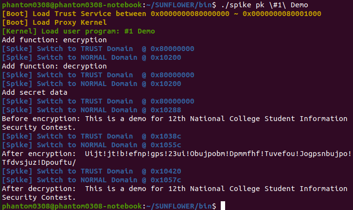
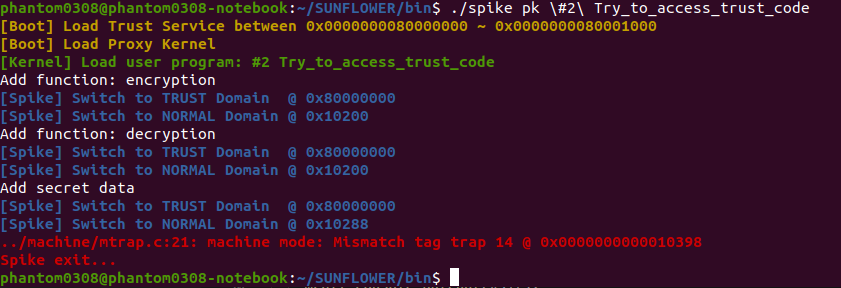
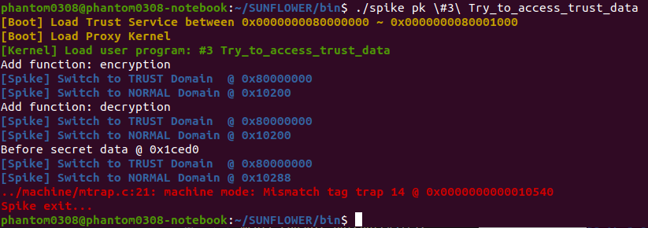
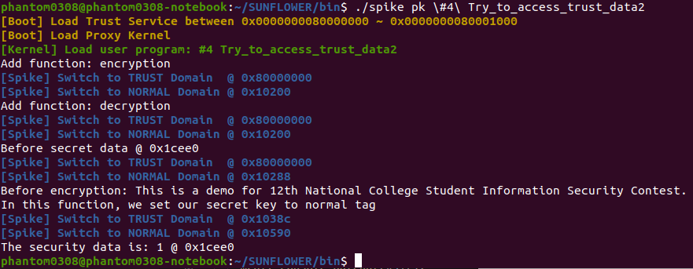

Sunflower Tools
=================================================================================
### Members:
   @ Great-Keith
   @ RainRain1218
   @ Phantom1003


Sunflower is a project for 12th National College Student Information Security Contest, China.
Our design provide a hardware machine to protect our secret data and code from the untrust operating system. 
Our project is based on riscv-tools, so you can use the script provided by UCB to build our project:
```bash
   $ sudo apt-get install autoconf automake autotools-dev curl libmpc-dev libmpfr-dev libgmp-dev libusb-1.0-0-dev gawk build-essential bison flex texinfo gperf libtool patchutils bc zlib1g-dev device-tree-compiler pkg-config python
   $ export RISCV=/you/install/path
   $ sh ./build.sh
```
After this you can run our project by:
```bash
   $ cd /you/install/path
   $ cd ./bin
   $ ./spike pk "#1 Demo"
   $ ./spike pk "#2 Try_to_access_trust_code"
   $ ./spike pk "#3 Try_to_access_trust_data"
   $ ./spike pk "#4 Try_to_access_trust_data2"
```
Or you can add the path of spike in your path.


The functions of each folder in the project are as follows:
| Folder                | Description                            |
|-----------------------|----------------------------------------|
| `riscv-opcodes`       | Opcodes for RISC-V ISA                 |
| `riscv-pk`            | A proxy Kernel for basic test          |
| `riscv-isa-sim`       | Spike simulator with tag check         |
| `riscv-fesvr`         | Front-end server                       |
| `riscv-openocd`       | Openocd for debugging Spike with GDB   |
| `riscv-gnu-toolchain` | GNU Compiler Toolchain                 |

`riscv-tests` is not needed in our project.


## Screenshot











